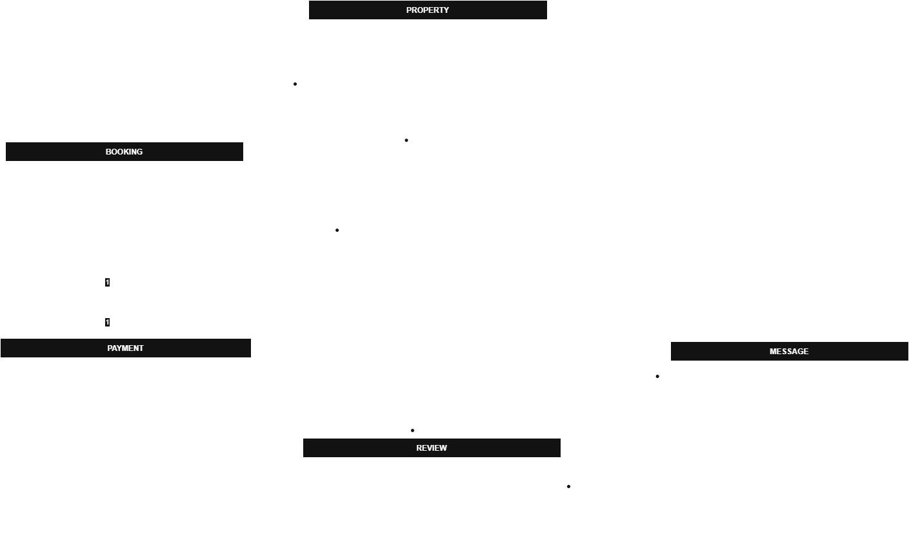

# Entity-Relationship Diagram (ERD) Specification

## 🎯 Objective
Create an ER diagram representing the AirBnB database.

## 📦 Entities and Attributes

### 1. **User**
- user_id (PK)
- first_name
- last_name
- email (Unique)
- password_hash
- phone_number
- role (ENUM: guest, host, admin)
- created_at

### 2. **Property**
- property_id (PK)
- host_id (FK → User.user_id)
- name
- description
- location
- pricepernight
- created_at
- updated_at

### 3. **Booking**
- booking_id (PK)
- property_id (FK → Property.property_id)
- user_id (FK → User.user_id)
- start_date
- end_date
- total_price
- status (ENUM: pending, confirmed, canceled)
- created_at

### 4. **Payment**
- payment_id (PK)
- booking_id (FK → Booking.booking_id)
- amount
- payment_date
- payment_method (ENUM: credit_card, paypal, stripe)

### 5. **Review**
- review_id (PK)
- property_id (FK → Property.property_id)
- user_id (FK → User.user_id)
- rating (INTEGER, 1–5)
- comment
- created_at

### 6. **Message**
- message_id (PK)
- sender_id (FK → User.user_id)
- recipient_id (FK → User.user_id)
- message_body
- sent_at

## 🔗 Relationships

- **User → Booking**: One-to-Many (a user can make many bookings)
- **User → Property**: One-to-Many (a host user can list many properties)
- **Property → Booking**: One-to-Many (a property can have many bookings)
- **Booking → Payment**: One-to-One (each booking has one payment)
- **User → Review**: One-to-Many (a user can write many reviews)
- **Property → Review**: One-to-Many (a property can have many reviews)
- **User → Message (sender)**: One-to-Many (a user can send many messages)
- **User → Message (recipient)**: One-to-Many (a user can receive many messages)

## 🖼️ Diagram File
The visual ER diagram is saved as:

